# Лабораторная работа №1: базовая настройка PostgreSQL на Debian

Цель: Настроить окружение, установить PostgreSQL в Debian, освоить базовые приёмы
администрирования системы и СУБД.

Выполнила Сологубова Влада ИС-22

## 1. Подготовка среды

В начале нужно было установить на виртуальной машине Debian. Была выбрана версия Debian 12.12.0, виртуальная машина VirtualBox. Ниже представлен процесс установки (рис. 1) и

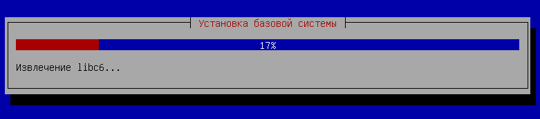

_Рисунок 1: Установка Debian_

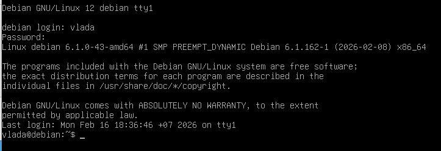

_Рисунок 2: Установленная система Debian после запуска_

После с помощью команд apt-get update и apt-get upgrade проверяем, что система обновлена (рис. 3). Команда apt-get update позволяет обновить список доступных пакетов и их версий, а команда apt-get upgrade выполняет установку доступных обновлений уже установленных пакетов.

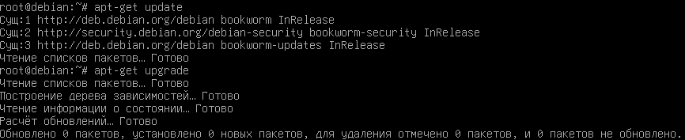

_Рисунок 3: Проверка обновлений системы_

## 2. Установка PostgreSQL

В данном пункте нужно было с помощью пакетного менеджера apt установить PostgreSQL (последнюю
доступную версию из репозиториев). Привести команды установки и их объяснение.

Чтобы установить PostgreSQLбыла использована команда apt-get install postgresql (рис. 4), которая выполняет установку сервера PostgreSQL из официальных репозиториев Debian с помощью пакетного менеджера apt, как и требуется в задании. После запуска команды автоматически загружаются и устанавливаются необходимые зависимости, а также выбирается последняя доступная стабильная версия пакета.

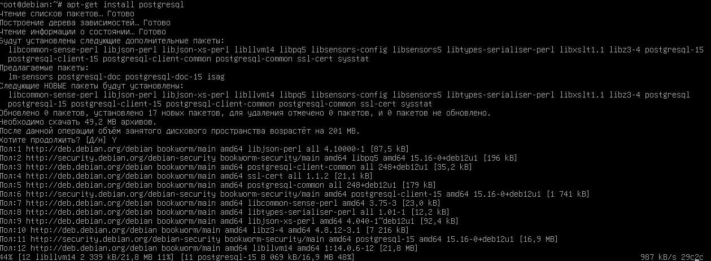

_Рисунок 4: Установка PostgreSQL с помощью пакетного менеджера apt_

После завершения установки была проверена версия PostgreSQL командой psql --version (рис. 5), которая показывает номер установленной версии клиента PostgreSQL и подтверждает корректность установки программного обеспечения в системе.

_Рисунок 5: Проверка установленной версии PostgreSQL_

Также с помощью команды systemctl status postgresql проверяем состояния службы PostgreSQL в системе (рис. 6). Команда показывает, запущен ли сервер базы данных, работает ли служба в данный момент, а также выводит её текущий статус и основные параметры запуска.

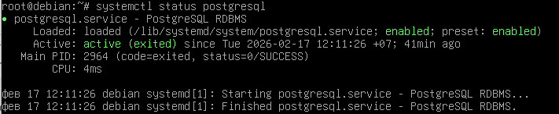

_Рисунок 6: Проверка состояния службы PostgreSQL_

## 3. Создание служебной учётной записи

В процессе установки PostgreSQL автоматически создаётся служебная учётная запись postgres. С помощью команды id postgres проверяем, что учётная запись postgres появилась (рис. 7). Данная команда выводит информацию о пользователе и подтверждает его существование в системе.

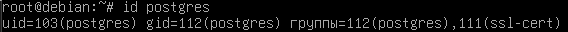

_Рисунок 7: Проверка состояния службы PostgreSQL_

Учётная запись postgres является служебной и используется для работы сервера баз данных PostgreSQL. От имени этого пользователя запускается служба СУБД, ему принадлежат файлы баз данных и служебные каталоги. Пользователь postgres имеет административные права внутри PostgreSQL и используется для управления базами данных и выполнения операций администрирования.

## 4. Первичная настройка конфигурационных файлов

В данном пункте нужно было найти и изучить основные файлы конфигурации PostgreSQL, внести изменения и перезапустить сервис
PostgreSQL. Основные конфигурационные файлы PostgreSQL расположенны по пути /etc/postgresql/15/main/ (рис. 8).

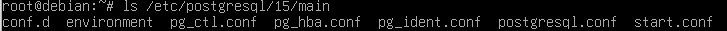

_Рисунок 8: Основные конфигурационные файлы PostgreSQL_

Файл postgresql.conf содержит основные параметры работы сервера базы данных: порт подключения, сетевые настройки и параметры производительности. С помощью текстового редактора nano файл был открыт и изменён порт с 5432 на 5433 (рис. 9).

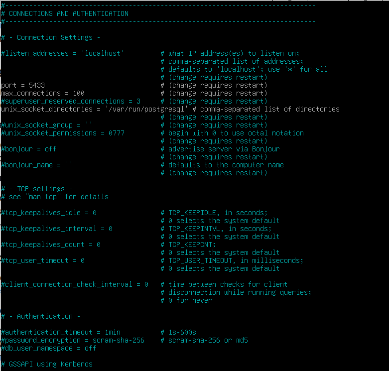

_Рисунок 9: Изменения в файле postgresql.conf_

Файл pg_hba.conf определяет правила аутентификации пользователей и методы подключения к серверу баз данных. В нём задаются типы подключений, пользователи и методы проверки подлинности (рис. 10). Здесь мы видим информацию о том, что пользователь postgres может входить без пароля локально.

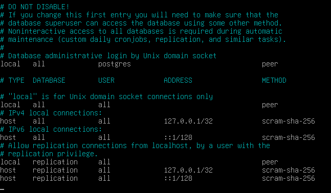

_Рисунок 10: Файл pg_hba.conf_

Также в папке main хранятся файлы pg_ident.conf, который задаёт сопоставление пользователей операционной системы и пользователей PostgreSQL, start.conf — определяет режим запуска сервера, pg_ctl.conf — содержит параметры управления запуском кластера, environment — задаёт переменные окружения для службы PostgreSQL и каталог conf.d — используется для размещения дополнительных файлов конфигурации.

После внесения изменений в файл postgresql.conf сервис PostgreSQL был перезапущен командой systemctl restart postgresql.

## 5. Управление сервисом

С помощью команды systemctl status postgresql проверяем состояние службы PostgreSQL (рис. 11). Сервер работает в статусе active (exited) - это означает, что служба PostgreSQL успешно выполнила запуск кластера баз данных и завершила собственный процесс, при этом сам сервер продолжает работать в фоновом режиме.

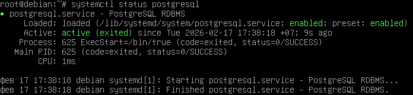

_Рисунок 11: Проверка работы сервиса PostgreSQL_

После для включения автоматического запуска PostgreSQL, при старте операционной системы, была выполнена команда systemctl enable postgresql (рис. 12).

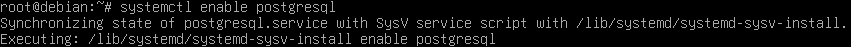

_Рисунок 12: Выполнение команды systemctl enable postgresql_

С помощью команды systemctl is-enabled postgresql проверяем настроился ли автозапуска (рис. 13). Результат enabled подтверждает, что автозапуск службы настроен.

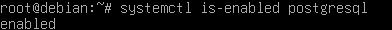

_Рисунок 13: Проверка автозапуска PostgreSQL_

## 6. Создание тестовой базы данных

В данном пункте нужно было создать отдельного пользователя, новую базу данных и использовать psql, чтобы проверить доступ к ней. В начале входим в аккаунт postgres (рис. 14), чтобы получить права администратора и иметь возможность создавать новых пользователей и базы данных. Далее используем команду psql, чтобы запустить интерактивную консоль PostgreSQL.

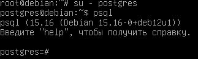

_Рисунок 14: Переход к пользователю postgres и запуск клиента psql_

Для создания пользователя была использована команда CREATE USER vasologubova WITH PASSWORD '123'; (рис. 15), которая создаёт нового пользователя и задаёт ей пароль. После создаём новую базу данных dbvasologubova с помощью команды CREATE DATABASE dbvasologubova OWNER vasologubova; где указываем названием новой бд и её владельца. Владелец базы данных получает полный доступ к её объектам.

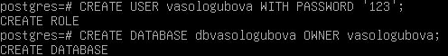

_Рисунок 15: Создание пользователя и базы данных_

Для проверки корректности создания пользователя и базы данных было выполнено подключение через клиент psql с помощью команды psql -U vasologubova -d dbvasologubova -h localhost -p 5433 (рис. 16). В команде указываются имя пользователя, который подключается к базе данных, и имя самой базы данных. Также для успешного подключения нужно указать -h localhost, что показывает, что соединение идёт к серверу PostgreSQL на этом же компьютере, и -p 5433, так как ранее порт был изменён в файле postgresql.conf со стандартного 5432.

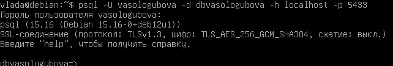

_Рисунок 16: Проверка доступа к базе данных через psql_

Подключение к базе данных было выполнено успешно.

## 7. Знакомство со схемами

В PostgreSQL схема — это логическая структура внутри базы данных, позволяющая группировать объекты. В отличие от базы данных, схема не является отдельным контейнером, а находится внутри базы. По умолчанию в каждой базе есть схема public.

По заданию нужно было создать схему test_schema (рис. 17) и выдать права на использование этой схемы созданному ранее пользователю. Так как схема создавалась под пользователем vasologubova, он автоматически стал её владельцем и уже имеет все необходимые права на использование схемы. Но если бы потребовалось выдать права пользователю, то это можно было бы сделать с помощью команды GRANT USAGE ON SCHEMA test_schema TO vasologubova;. Эта команда позволяет предоставить пользователю право использовать схему и её объекты, если он не является владельцем.

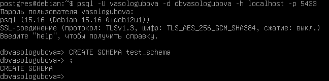

_Рисунок 17: Создание схемы test_schema_

Далее нужно было продемонстрировать методы работы с разными схемами. Чтобы работать в конкретной схеме можно использовать search_path (рис. 18) — настройку PostgreSQL, которая говорит, в какой схеме искать таблицы и другие объекты по умолчанию. С помощью команды SET search_path TO test_schema; можно переключится на нужно схему и работать конкретно в ней. Команда SHOW search_path показывает какая сейчас схема выбрана, команда \dt test_schema.\* показывает все таблицы внутри указанной схемы.

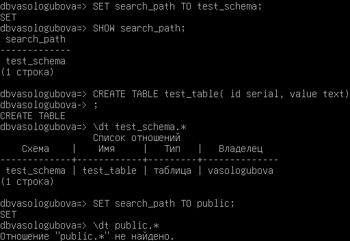

_Рисунок 18: Работа с search_path_

Также с схемами можно работать через явное её указание (рис. 19).

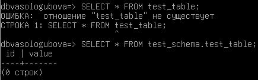

_Рисунок 19: Работа с явным указанием схемы_

## 8. Использование утилиты psql для базовых операций

В данном пункте нужно было в схеме public создать таблицу (рис. 20) и внести несколько записей с помощью основных SQL-запросов: SELECT, INSERT, UPDATE, DELETE. SELECT позволяет просмотреть все записи в таблице или через оператор WHERE выбрать данные по определённым условиям. INSERT используется для добавления новых записей в таблицу. UPDATE нужен для изменения уже существующих записей в таблице. DELETE используется для удаления записей из таблицы.

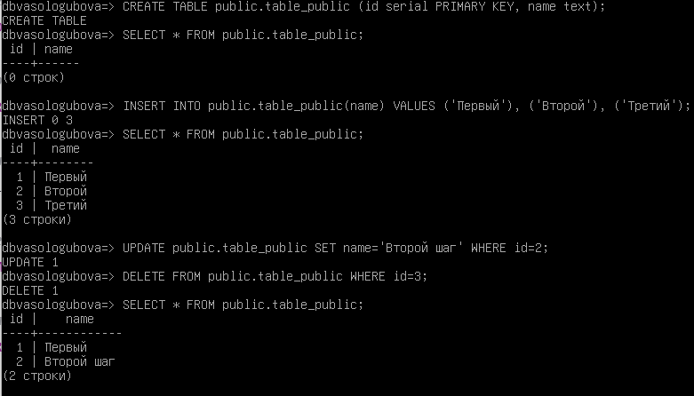

_Рисунок 20: Работа с таблицей table_public_

Теперь создаём таблицу в схеме test_schema (рис. 21) и с помощью команды INSERT добавляем данные. Команда SELECT позволяет убедиться, что записи корректно отображаются в таблице.

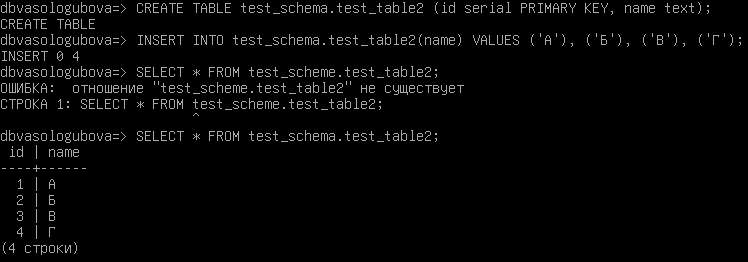

_Рисунок 21: Работа с таблицей test_table2_

Для демонстрации работы с таблицами с привязкой к конкретной схеме в данном пункте везде было использовано явное указание нужной схемы.

## 9. Настройка локальных и сетевых подключений

Чтобы настроить доступ к базе данных по локальной сети нужно изменить параметр listen_addresses в файле postgresql.conf (рис. 22), который определяет, на каких сетевых интерфейсах сервер принимает входящие подключения. Было выставлено значение '\*', что разрешает подключение с любых сетевых адресов, а не только с localhost.

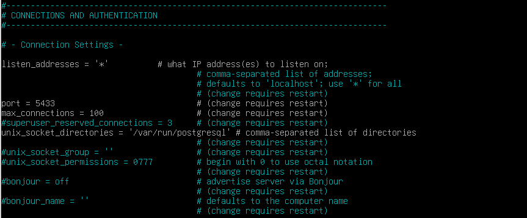

_Рисунок 22: Изменение параметра listen_addresses в файле postgresql.conf_

Также, чтобы настроить доступ к базе данных по локальной сети, добавляем в файл pg_hba.conf строчку host all all 0.0.0.0/0 md5 (рис. 23), которая разрешает подключение к серверу PostgreSQL по протоколу TCP/IP для всех пользователей и ко всем базам данных с любых IP-адресов при условии ввода пароля.

Сам файл pg_hba.conf управляет правилами аутентификации, поэтому каждая строка в нём - это отдельное правило доступа. Строки имеют следующий формат: TYPE DATABASE USER ADDRESS METHOD. Первый параметр определяет тип подключения ( host - подключение по сети). Второй параметр указывает, к каким базам данных разрешён доступ (all - ко всем). Третий параметр задаёт пользователя, которому разрешено подключение. Четвёртый параметр - это IP-адрес или диапазон адресов, с которых допускается подключение (0.0.0.0/0 0 - любые адреса). Последний параметр определяет метод аутентификации (md5 — проверка пароля в зашифрованном виде).

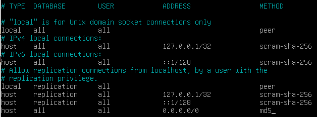

_Рисунок 23: Изменение файла pg_hba.conf_

После внесения изменений сервис PostgreSQL был перезапущен для применения настроек. Теперь нужно было произвести подключение через pgadmin или dbeaver с локальной машины. Для подлкючения к бд был выбран pgadmin, в нём был указан IP-адрес виртуальной машины, порт (5433), имя базы данных и учётные данные пользователя (рис. 24).

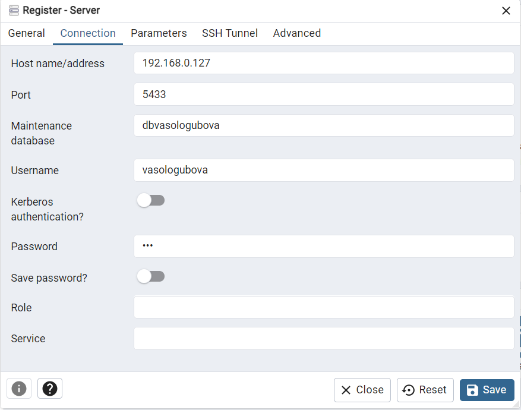

_Рисунок 24: Настройки подключения к базе данных через pgAdmin_

Подключение выполнено успешно (рис. 25).

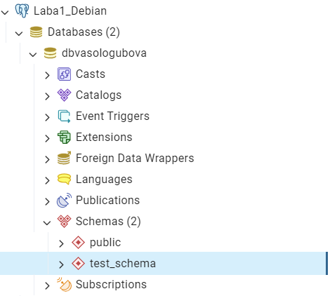

_Рисунок 25: Успешное подключение к базе данных через pgAdmin_

## 10. Журналирование (logging)

В данном пункте нужно было произвести настройку журналирования сервера PostgreSQL. Для этого в файле postgresql.conf были изменены параметры, отвечающие за ведение логов (рис. 26): logging_collector = on включает сбор логов в файлы, log_directory = 'log' задаёт каталог хранения логов, log_filename = 'postgresql-%Y-%m-%d\*%H%M%S.log' отвечает за формат имени файла журнала, log_min_messages = info записывает сообщения уровня info и выше. Также был изменён параметр log_statement = 'all', который позволяет записывать в журнал все выполняемые SQL-запросы.

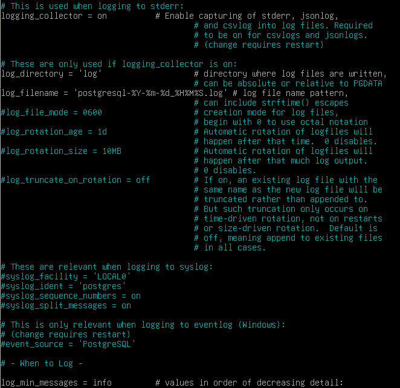

_Рисунок 26: Изменение файла postgresql.conf_

После внесения изменений сервер PostgreSQL был перезапущен для применения новых настроек. Далее были выполнены команды SELECT и INSERT для проверки работы журналирования (рис. 27).

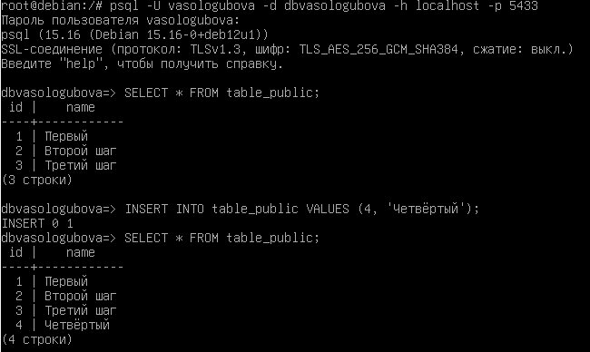

_Рисунок 27: Выполнение SQL команд SELECT и INSER_

Файлы журналов находятся в каталоге данных PostgreSQL /var/lib/postgresql/15/main/log. В журнале есть записи о запуске и остановке сервера, а также выполненные SQL-запросы (рис. 28).

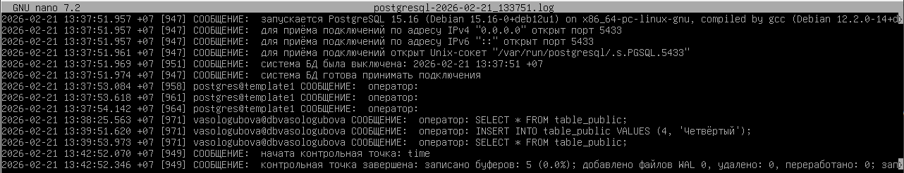

_Рисунок 28: Логи в файле postgresql-2026-02-21_133751.log_

## 11. Назначение ролей и прав

В последнем пункте нужно было создать роль с ограниченными привилегиями и протестировать, какие операции она может выполнять. Была создана роль limited_user (рис. 29), у которой нет прав.

_Рисунок 29: Создание роли limited_user_

Далее ей были выданы права только на подключение к бд dbvasologubova (рис. 30), поэтому подключение прошло успешно, а вот просмотреть данные в таблице данная роль не может.

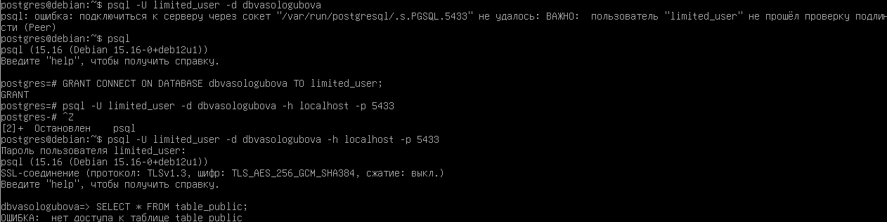

_Рисунок 30: Создание роли limited_user_

После выдаём права на чтение таблицы (рис. 31) также с помощью команды GRANT. GRANT в PostgreSQL позволяет управлять доступом пользователей к базе данных и её объектам. С помощью GRANT можно точно определить, какие действия разрешены пользователю. С помощью команды GRANT CONNECT ON DATABASE dbvasologubova TO limited_user; можно выдать право на подключение к базе данных, GRANT SELECT ON table_public TO limited_user; даёт право только на чтение данных из таблицы, а например GRANT INSERT, UPDATE, DELETE ON table_public TO limited_user; разрешает изменять данные в таблице table_public.

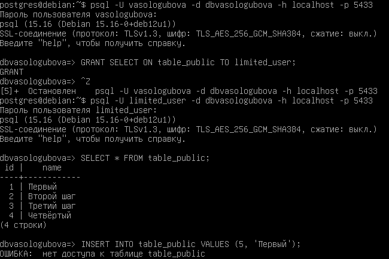

_Рисунок 31: Выдача прав на чтение таблицы table_public_

Также с помощью GRANT editors TO limited_user; можно сделать пользователя членом роли, чтобы он автоматически наследовал все права этой роли (рис. 32). Создаём роль editors, которой выдаём право на изменение данных в таблице table_public. После делаем пользователя limited_user членом роли editors. Теперь он наследет все права этой роли.

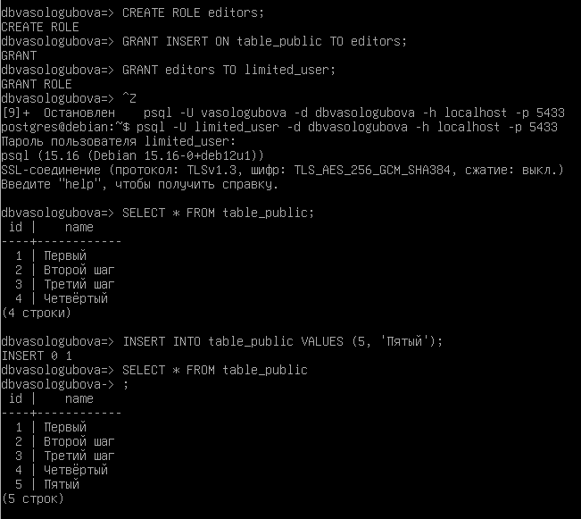

_Рисунок 32: Демонстрация наследования прав между ролями_

Также с помощью команды \du можно наглядно посмотреть список всех пользователей и ролей в PostgreSQL, их атрибуты и какие права они имеют.

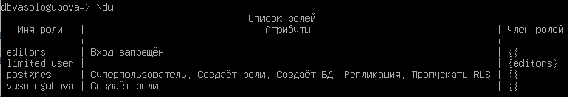

_Рисунок 33: Просмотр списка ролей_

Вывод: В ходе лабораторной работы было настроено окружение на базе Debian, установлена PostgreSQL, изучены основные файлы конфигурации, выполнена настройка сетевых подключений и журналирования, освоены базовые команды администрирования. Также была продемонстрирована работа с ролями и выдачей прав через GRANT, включая наследование прав. В результате были получены практические навыки установки, настройки и базового администрирования PostgreSQL в среде Debian.
