# Лабораторная работа №2: резервное копирование, восстановление и мониторинг в Debian и PostgreSQL

Цель: Изучить способы резервного копирования баз данных PostgreSQL и восстановления их в среде Debian. Освоить базовые инструменты мониторинга системы и сервиса PostgreSQL.

Выполнила Сологубова Влада ИС-22

## 1. Утилиты резервного копирования

В первом задании нужно было изучить и сравнить pg_dump и pg_basebackup. Также описать сценарии применения
каждой утилиты.

Для резервного копирования баз данных PostgreSQL чаще всего используются утилиты pg_dump и pg_basebackup.

Утилита pg_dump выполняет логическое резервное копирование базы данных. Она создаёт файл с SQL-командами, которые позволяют восстановить структуру базы данных и её содержимое. С помощью pg_dump можно создавать резервные копии отдельных баз данных, схем или таблиц. Применяется если нужно произвести резервное копирование отдельных баз данных или их объектов.

Утилита pg_basebackup предназначена для физического резервного копирования всего сервера PostgreSQL. При применении она копирует все файлы сервера. Такой тип используется в ситуациях, когда требуется полное резервное копирование сервера PostgreSQL, чтобы была возможность при необходимости произвести восстановление всей системы.

Утилиты pg_dump и pg_basebackup отличаются типом резервного копирования и областью применения. pg_dump выполняет логическое резервное копирование, сохраняя структуру базы данных и данные в виде SQL-команд. При восстановлении эти команды выполняются заново, и база данных создаётся снова. А вот pg_basebackup выполняет физическое резервное копирование, сохраняя не SQL-команды, а реальные файлы базы данных, которые находятся в каталоге данных PostgreSQL. То есть создаётся точная копия файлов сервера. Поэтому pg_dump чаще используется для работы с отдельными базами данных, а pg_basebackup применяется для полного резервного копирования сервера и восстановления всей системы.

## 2. Создание резервной копии

Во втором задании нужно было выполнить полное резервное копирование базы данных из лаб. №1 и использовать различные параметры, объяснить разницу. При выполнении полного резервного копирования бд были использвоаны параметры -Fc, -Ft, -s и -a (рис. 1).

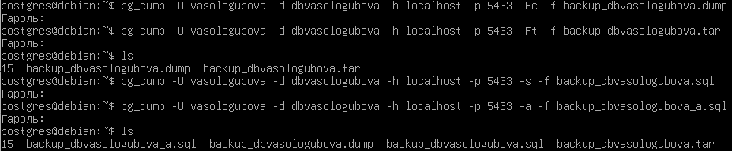

_Рисунок 1: Выполнение резервного копирования базы данных dbvasologubova с различными параметрыми_

Параметр -Fc создаёт резервную копию в custom формате. Это специальный бинарный формат PostgreSQL, который позволяет восстанавливать отдельные объекты базы данных с помощью утилиты pg_restore. Данный формат позволяет поддерживать гибкое восстановление отдельных объектов.

Параметр -Ft используется для создания резервной копии базы данных в формате tar-архива. В этом случае результат работы pg_dump сохраняется не в обычный SQL-файл, а в архивный файл формата .tar, внутри которого находятся файлы, содержащие структуру базы данных и данные таблиц. Формат tar удобен тем, что его легко хранить, переносить или копировать на другой сервер.

Параметр -s сохраняет только структуру базы данных, без данных таблиц. В резервной копии будут только команды создания таблиц, схем и других объектов. При использовании данного параметра создаётся обычный текстовый SQL-файл, в котором будут SQL-команды (рис. 2).

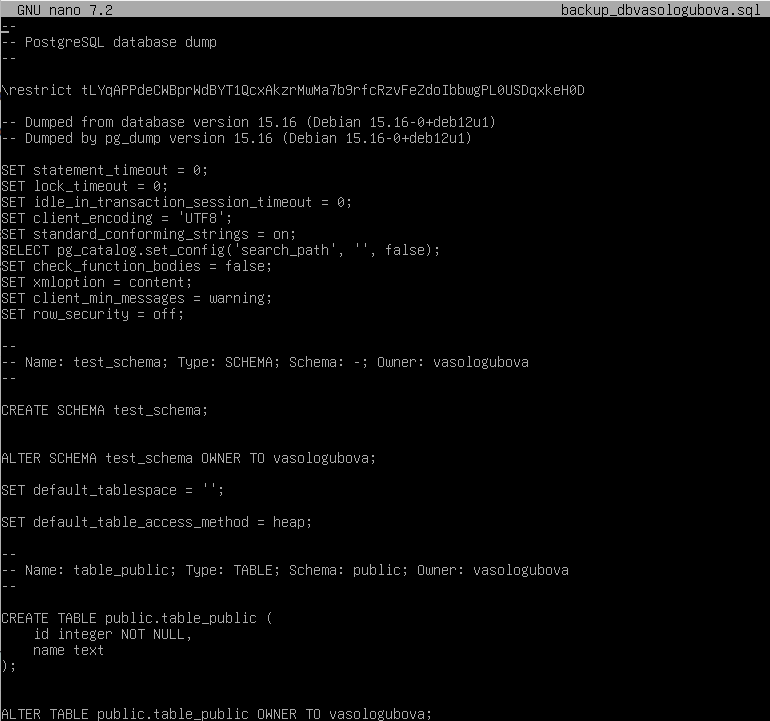

_Рисунок 2: Файл backup_dbvasologubova.sql_

Параметр -a сохраняет только данные таблиц, без структуры базы данных. Также как при использваонии параметра -s, после применения резервного копирования с параметром -a создаётся обычный текстовый SQL-файл, в котором хранятся SQL-команды (рис. 3).

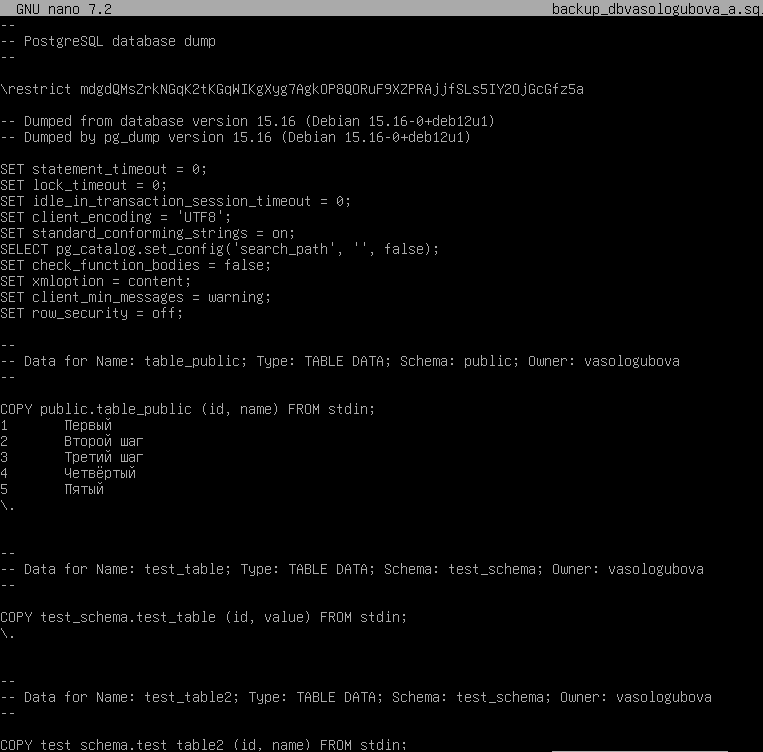

_Рисунок 3: Файл backup_dbvasologubova_a.sql_

## 3. Частичное (выборочное) резервное копирование

В третьем задании нужно было сделать дамп только определённой схемы (была выбрана test_schema из ЛР №1) и сделать дамп только определённой таблицы из схемы public (была выбрана таблица table_public).

При выполнении резервного копирования определённой схемы использовалась команда pg_dump -U vasologubova -d dbvasologubova -h localhost -p 5433 -n test_schema -f backup_test_schema.sql, где -n указываем схему, для которой создаётся резервная копия, а в -f прописывается файл, в который происходит сохранение. При выполнении резервного копирования определённой таблицы из схемы public была использована команда pg_dump -U vasologubova -d dbvasologubova -h localhost -p 5433 -t public.table_public -f backup_table_public.sql, где в -t указываем конкретную таблицу для резервного копирования, а в -f также прописываем файл (рис. 4).

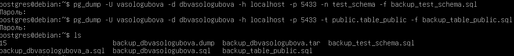

_Рисунок 4: Резервоное копирование схемы test_schema и таблицы table_public_

В отличие от полного резервного копирования базы данных, при котором сохраняются все схемы, таблицы и данные, выборочное резервное копирование позволяет сохранить только нужные объекты. Это удобно в случаях, когда необходимо перенести или восстановить отдельную часть базы данных без создания полной копии всей системы.

## 4. Восстановление из резервной копии

В данном задании нужно было восстановить базу из резервного файла с помощью pg_restore или утилиты psql. Для востановления базы данных dbvasologubova была создана новая бд dbvasologubova_restore, куда будут восстанавливаться данные (рис. 5).

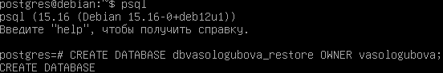

_Рисунок 5: Создание базы данных dbvasologubova_restore для востановления базы данных dbvasologubova_

После была выполнена команда pg_restore -U vasologubova -d dbvasologubova_restore -h localhost -p 5433 backup_dbvasologubova.dump, которая позволяет восстановить структуру базы данных, схемы, таблицы и все записи из резервной копии backup_dbvasologubova.dump в новую базу dbvasologubova_restore.

После востановления для проверки корректности выполнения операции были использованы команды \dn - показывает схемы бд, \dt - показывает таблицы и выборка данных через SELECT (рис. 6).

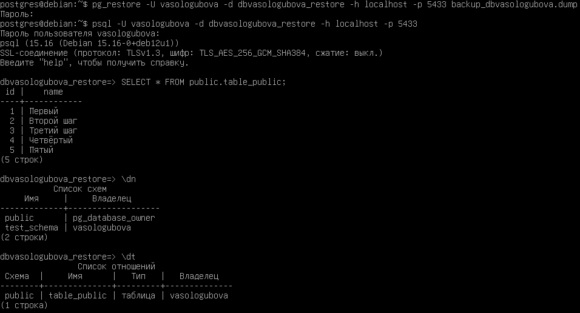

_Рисунок 6: Востановление базы данных и проверка результатов_

## 5. Автоматизация бэкапов с помощью cron

В данном пункте нужно было настроить планировщик cron на Debian, чтобы ежедневно создавать резервные копии. Также нужно было указать, куда складываются дампы, и как выполняется ротация.

Для автоматизации резервного копирования базы данных используется планировщик задач cron, который позволяет запускать заданные команды или скрипты по расписанию в операционной системе Debian без участия пользователя.

В начале была создана папка backup по пути home/vasologubova, в которой будут сохраняться резервные копии. Далее с помощью команды crontab -e была добавлена команда 40 16 \* \* \* pg*dump -U vasologubova -h localhost -p 5433 -Fc dbvasologubova -f /home/vasologubova/backups/dbvasologubova_backup*$(date +\%Y-\%m-\%d).dump, которая ежедневно в 16:40 выполняет создание резервной копии базы данных с помощью утилиты pg_dump. Резервные копии сохраняются в каталоге /home/vasologubova/backups с указанием даты в имени файла. После с помощью команды crontab -l была проведена проверка, что команда успешно добавлена (рис. 7).

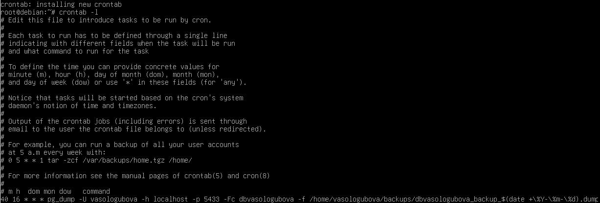

_Рисунок 7: Добавлена команда для ежедневного резервного копирования_

Также была настроена ротация резервных копий. С помощью команды ls -t /home/vasologubova/backups/\*.dump | tail -n +6 | xargs rm -f было настроено автоматическое удаление файлов, когда их количество превышает 5 (рис. 8). Команда ls -t сортирует файлы по дате изменения, после команда tail выбирает файлы, выходящие за пределы первых пяти, и передаёт их команде rm для удаления. Ротация очень полезна, так как позволяет предотвращать переполнение дискового пространства и поддерживать актуальный набор резервных копий.

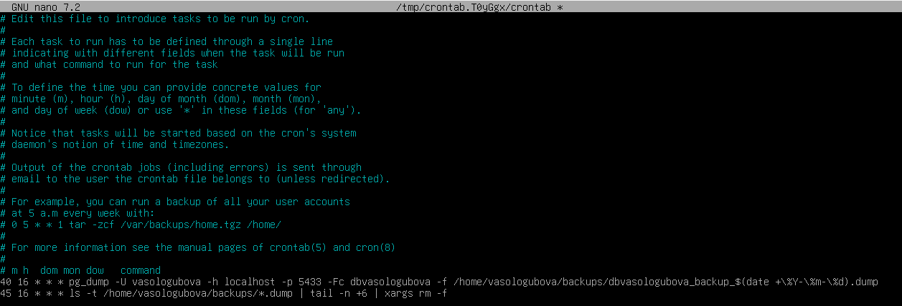

_Рисунок 8: Файл конфигурации cron с добавленными командами_

Ниже представлена одна из резервных копий базы данных, которая была автоматически создана после корректной настройки планировщика cron (рис. 9).

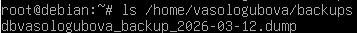

_Рисунок 9: Резервная копия базы данных, созданная автоматически_

## 6. Мониторинг состояния системы

В данном пункте нужно было использовать стандартные инструменты Debian (были выбраны top, htop, iotop) для
мониторинга потребления ресурсов PostgreSQL (CPU, RAM, IO).

Утилита top позволяет наблюдать загрузку процессора, использование оперативной памяти и список активных процессов системы (рис. 10). В верхней части отображается информация об использовании оперативной памяти и swap-памяти. В таблице процессов представлены показатели PID, пользователь процесса, приоритет, использование памяти, загрузка процессора и время работы процесса. Анализ этих показателей позволяет контролировать потребление ресурсов системой и процессами, включая сервер PostgreSQL.

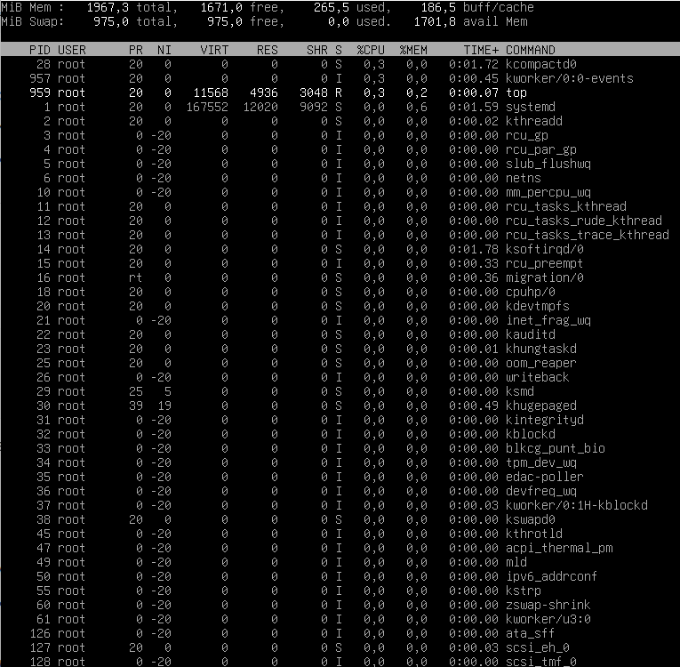

_Рисунок 10: Мониторинг загрузки системы с помощью утилиты top_

Утилита htop предоставляет более наглядное отображение загрузки ресурсов и процессов PostgreSQL (рис. 11). Для каждого процесса показываются такие параметры, как идентификатор процесса (PID), пользователь, приоритет, использование памяти, загрузка процессора и время работы процесса. С помощью htop можно наблюдать за работой процессов сервера PostgreSQL и анализировать их влияние на использование ресурсов системы.

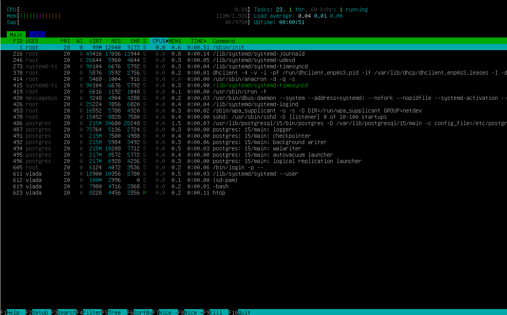

_Рисунок 11: Мониторинг процессов системы с помощью утилиты htop в вкладке Main_

Также кроме вкладки Main, в htop присутствует вкладка I/O (рис. 12), которая предназначена для мониторинга операций ввода-вывода в системе. В данном режиме отображается информация о скорости чтения (Read) и записи (Write), а также процессы, которые активно используют диск. Это позволяет выявлять узкие места, связанные с высокой нагрузкой на подсистему хранения данных. В отличие от основной вкладки Main, где акцент сделан на процессоре и оперативной памяти, вкладка I/O помогает анализировать производительность системы с точки зрения работы с файлами и накопителями.

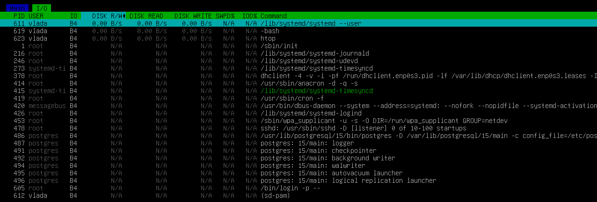

_Рисунок 12: Мониторинг процессов системы с помощью утилиты htop в вкладке I/O_

Утилита iotop используется для мониторинга операций ввода-вывода диска и позволяет увидеть, какие процессы выполняют чтение и запись данных на диск (рис. 13). В таблице отображаются идентификатор процесса (TID), приоритет операций ввода-вывода, пользователь процесса, скорость чтения данных с диска (DISK READ), скорость записи на диск (DISK WRITE), а также имя выполняемой команды. Анализ этих показателей позволяет определить, какие процессы создают нагрузку на дисковую подсистему и как активно используются ресурсы хранения данных.

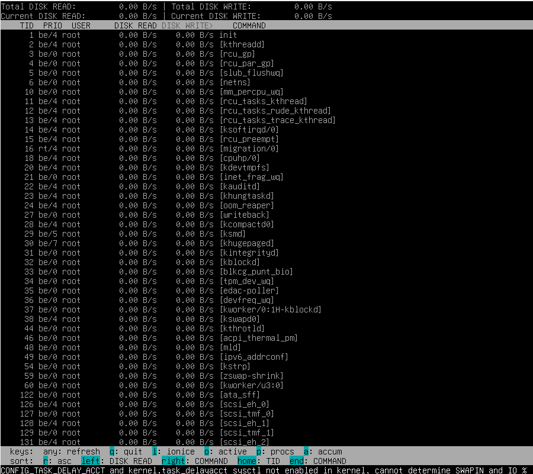

_Рисунок 13: Мониторинг операций ввода-вывода диска с помощью утилиты iotop_

## 7. Мониторинг PostgreSQL

В данном пункте нужно было изучить встроенные представления статистики в PostgreSQL (pg_stat_activity и pg_stat_database), показать, как смотреть активные процессы, долгие запросы и т.д. Показать как можно принудительно завершить процесс зависший или слишком тяжелый запрос.

PostgreSQL имеет встроенные представления статистики, которые позволяют отслеживать активность сервера, количество подключений, выполняющиеся запросы и нагрузку на базу данных. Основные из них это pg_stat_activity и pg_stat_database.

Представление pg_stat_activity показывает текущие активные сессии и выполняемые запросы. С помощью команды SELECT pid, usename, datname, state, query, query_start, backend_start FROM pg_stat_activity; можем выбрать конкретные столбцы из данного представления, которые нас интересуют (рис. 14). В данном случае были выбраны столбцы: pid - идентификатор процесса PostgreSQL, usename - имя пользователя, который выполняет запрос, datname - база данных, к которой подключён процесс, state - состояние сессии (active, idle, idle in transaction, waiting), query - SQL-запрос, который выполняется, query_start - время начала выполнения запроса и backend_start - время запуска процесса сессии.

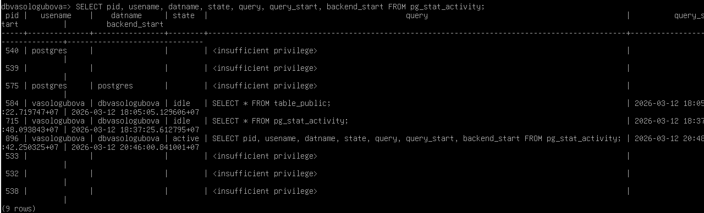

_Рисунок 14: Использование pg_stat_activity_

Для поиска долгих или «тяжёлых» запросов можно использовать дополнительное условие. Например, команда SELECT pid, usename, datname, state, query, now() - query_start AS duration FROM pg_stat_activity WHERE state = 'active' AND now() - query_start > interval '5 minutes'; позволяет найти процессы, которые выполняются более пяти минут (рис. 15).

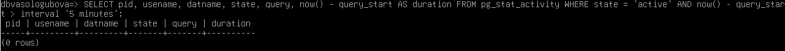

_Рисунок 15: Поиск долгих запросов_

Представление pg_stat_database показывает статистику по каждой базе данных сервера PostgreSQL, включая количество подключений, транзакций и операций чтения и записи. С помощью команды SELECT datname, numbackends, xact_commit, xact_rollback, blks_read, blks_hit FROM pg_stat_database; можно выявить какая база создаёт нагрузку на сервер (рис. 16).

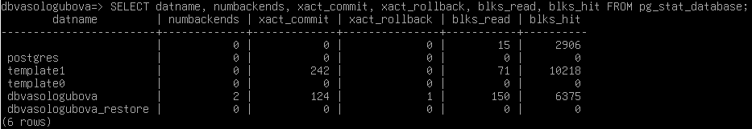

_Рисунок 16: Использование pg_stat_database_

Если нужно принудительно завершить процесс зависший или слишком тяжелый запрос, пользователь должен иметь права суперпользователя. Сначало узнаём PID зависшего или долгого запроса с помощью представления pg_stat_activity. После этого можно завершить процесс с помощью команды SELECT pg_terminate_backend(идентификатор процесса);. После выполнения данной команды соответствующая сессия будет принудительно завершена, а выполняемый запрос остановлен. При этом текущая транзакция будет автоматически отменена.

## 8 Логирование и анализ логов

В данном пункте нужно было найти логи PostgreSQL и системные логи Debian (в директории /var/log/). Определить, какие события логгирует СУБД, а какие – ОС.

Каталог /var/log в Debian содержит журналы работы операционной системы и различных служб (рис. 17). Эти файлы используются для диагностики ошибок, анализа работы системы и отслеживания событий.

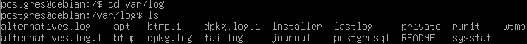

_Рисунок 17: Файлы в /var/log/_

Чтобы просмотреть системные логи Debian, была использована команда nano dpkg.log, которая позволяет вывести записи журнала пакетного менеджера. В данном журнале отображаются действия, связанные с установкой, обновлением и удалением программных пакетов (рис. 18).

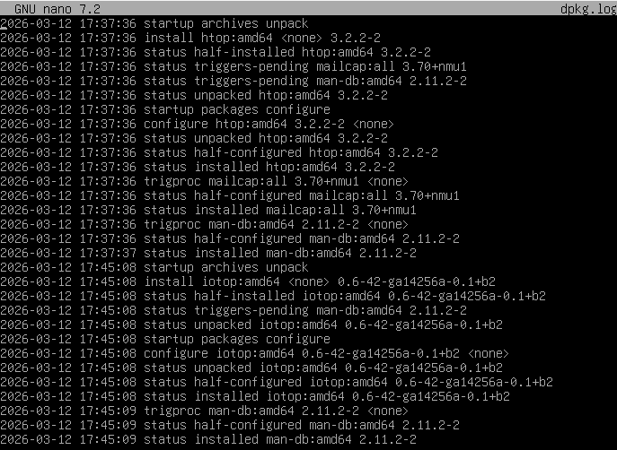

_Рисунок 18: Просмотр системного журнала Debian (dpkg.log)_

В каталоге PostgreSQL хранятся журналы работы сервера базы данных. Для просмотра содержимого каталога была использована команда ls /var/log/postgresql, которая показывает файлы логов PostgreSQL. В данном каталоге находятся файлы журналов, содержащие информацию о запуске и остановке сервера, подключениях пользователей к базам данных, выполнении запросов и возникающих ошибках (рис. 19).

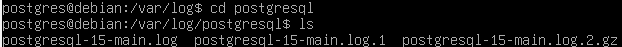

_Рисунок 19: Каталог /var/log/postgresql_

Для просмотра содержимого журнала работы PostgreSQL был открыт файл postgresql-15-main.log. В данном файле отображаются события работы сервера PostgreSQL, такие как запуск сервера, подключение пользователей, выполнение запросов и сообщения об ошибках (рис. 20).

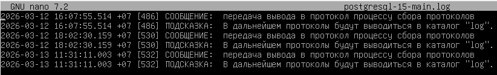

_Рисунок 20: Просмотр журнала работы PostgreSQL_

Системные журналы Debian фиксируют события, связанные с работой операционной системы и её служб, например установку и обновление программ, запуск сервисов и системные ошибки. Журналы PostgreSQL содержат информацию о работе сервера базы данных, включая запуск и остановку сервера, подключения пользователей, выполнение SQL-запросов и возникающие ошибки. Получается, что системные логи Debian отражают работу операционной системы в целом, тогда как логи PostgreSQL содержат информацию непосредственно о работе сервера базы данных и взаимодействии пользователей с бд.

Вывод: в ходе лабораторной работы были изучены способы резервного копирования баз данных PostgreSQL с использованием утилит pg_dump и pg_basebackup, выполнено создание полных и выборочных резервных копий, а также восстановление базы данных из резервного файла. Также была настроена автоматизация резервного копирования с помощью планировщика cron и реализовано автоматическое удаление старых резервных копий. Кроме того, были освоены инструменты мониторинга системы (top, htop, iotop) и встроенные средства мониторинга PostgreSQL (pg_stat_activity, pg_stat_database), а также проведён анализ системных и серверных логов. В результате были получены практические навыки резервного копирования, восстановления и мониторинга работы PostgreSQL в среде Debian.
